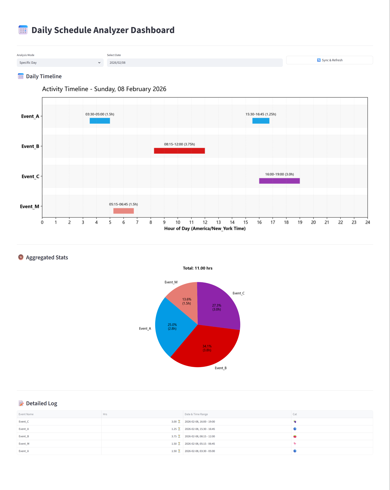

# 📅 Daily Schedule Analyzer Dashboard

[](https://www.python.org/)
[](https://streamlit.io/)
[](https://plotly.com/python/)
[](LICENSE)

A professional productivity telemetry dashboard that interfaces with the **Google Calendar API**. This tool ingests calendar events, normalizes temporal data, and visualizes daily schedules using a custom **Gantt-style Swimlane Engine** and aggregated distribution metrics.

Designed for engineers and professionals who need granular insights into their time allocation, context switching, and deep work distribution.



## 💡 Motivation


Google Calendar's native **"Time Insights"** feature provides valuable analytics, but it is restrictively gatekept behind paid **Google Workspace** and **Education** editions. Standard users with personal accounts are left without tools to quantify their time allocation.

I built this dashboard to **democratize time telemetry**. It bridges the gap between personal scheduling and enterprise-grade analytics, enabling any user to:
1.  **Unlock "Time Insights" for Free**: visualize where your time goes without a monthly subscription.
2.  **Quantify Deep Work**: Move beyond simple calendar viewing to actionable data analysis.
3.  **Optimize Routine**: Use granular data to identify context-switching costs and adjust daily habits for peak performance.
  
## ✨ Key Features

* **Advanced Visualization Engine**:
    * **Smart Layout Algorithms**: Implements **Horizontal Staggering** to prevent label overlap for short-duration events, ensuring readability even in dense schedules.
    * **Boundary Clamping**: Automatically adjusts text anchors for cross-day events (e.g., sleeping past midnight) so labels remain visible within the viewport.
    * **Dual-Label Analytics**: Pie charts display both **Percentage** and **Absolute Hours** for precise time-cost analysis.

* **Master-Detail Interaction (SPA Experience)**:
    * **Zero-Jump Navigation**: Replaced standard page reloads with **Native Modals** (`@st.dialog`). Click any "View Detail" button to open a focused modal window instantly.
    * **Custom Grid System**: A pixel-perfect list view that renders HTML descriptions from Google Calendar into clean Markdown.

* **ETL Pipeline**:
    * **Wide-Fetch Strategy**: Automatically broadens the API query window to handle UTC timezone offsets without data loss.
    * **Timezone Synchronization**: Auto-detects and converts calendar events to the user's local system time.

## 🛠️ Tech Stack

* **Frontend**: Streamlit (Session State, Dialogs, Custom CSS Injection)
* **Data Processing**: Pandas
* **Visualization**: 
    * **Plotly Graph Objects** (Interactive Timeline Engine)
    * **Matplotlib** (Static Distribution Charts)
* **Backend**: Google Client Library for Python

## 📂 Project Structure

The project follows a modular architecture for scalability and maintainability:

```text
Google-Calendar-Analyzer/
├── app.py                 # Main entry point (Streamlit UI)
├── requirements.txt       # Python dependencies
├── credentials.json       # Google OAuth2 Credentials (DO NOT COMMIT)
├── token.json             # User Access Token (Auto-generated)
├── src/
│   ├── __init__.py
│   ├── auth.py            # Google Calendar API Authentication
│   ├── data_loader.py     # Data fetching, cleaning & HTML parsing
│   ├── visualization.py   # Plotly & Matplotlib rendering logic
│   ├── utils.py           # Interval scheduling algorithms
│   └── config.py          # Configuration (Color maps, Emojis)
└── README.md
```

## 🚀 Installation & Setup

### 1. Clone the Repository
```bash
git clone https://github.com/Eric-LLMs/Google-Calendar-Analyzer.git
cd Google-Calendar-Analyzer

```

### 2. Install Dependencies

It is recommended to use a virtual environment to avoid conflicts.

```bash
# Create virtual environment
python -m venv venv

# Activate it (Windows)
venv\Scripts\activate

# Activate it (Mac/Linux)
source venv/bin/activate

# Install libraries
pip install -r requirements.txt

```

*Create a `requirements.txt` file with the following content if it doesn't exist:*

```text
streamlit
pandas
matplotlib
plotly>=5.0.0
google-auth
google-auth-oauthlib
google-auth-httplib2
google-api-python-client

```

### 3. Google Calendar API Setup (Crucial)

To run this app, you need your own credentials from the Google Cloud Console.

1. Go to the [Google Cloud Console](https://console.cloud.google.com/).
2. Create a new project and enable the **Google Calendar API**.
3. Configure the **OAuth consent screen** (set to "External" and add your email as a test user).
4. Go to **Credentials** -> **Create Credentials** -> **OAuth client ID** (Desktop App).
5. Download the JSON file, rename it to `credentials.json`, and place it in the **project root directory**.

### 4. Run the Dashboard

```bash
streamlit run app.py

```

*On the first run, a browser window will open asking you to log in to your Google account to authorize read-only access to your calendar. A `token.json` file will be generated automatically for future logins.*

## 📊 Usage Guide

* **Select Mode**: Choose between "Specific Day", "Last N Days", or "Custom Range" from the top dropdown.
* **Timeline View**: For single-day analysis, the Swimlane Timeline shows exact start/end times. Overlapping events are automatically stacked to avoid visual clutter.
* **Aggregated Stats**: The Pie Chart shows the percentage breakdown of your time based on Event Color categories (e.g., Deep Work vs. Meetings).
* **Detailed Log**: A tabular view at the bottom provides raw data export capabilities with precise timestamps.

## 🔒 Privacy Note

This application runs **locally** on your machine.

* Your calendar data is processed in-memory using Pandas.
* No data is sent to any third-party server (other than Google's API for fetching).
* Your `credentials.json` and `token.json` contain sensitive access keys—**never commit them to GitHub**.

## 🤝 Contributing

Contributions are welcome! Please feel free to submit a Pull Request.

## 📄 License

This project is licensed under the MIT License.

```

```